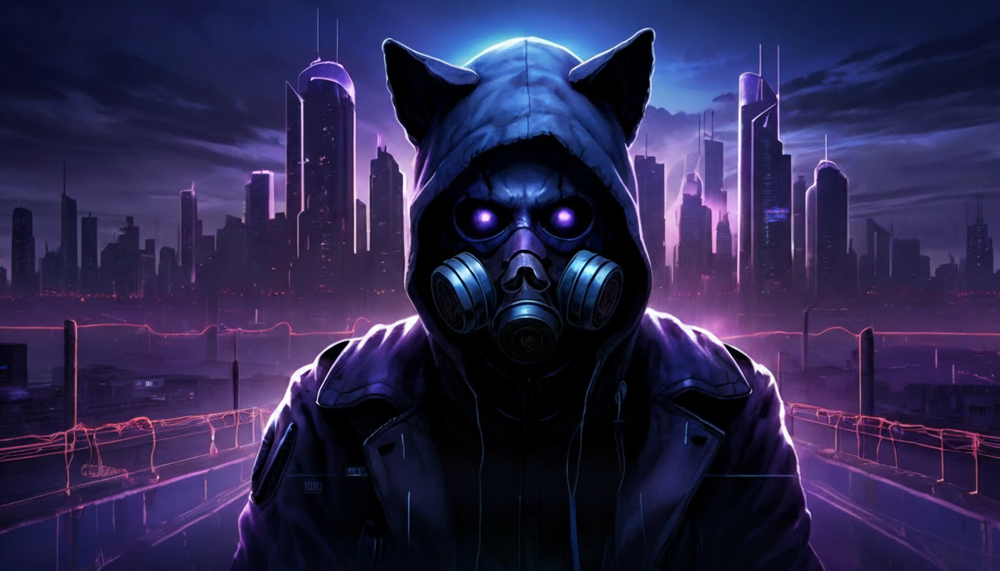

# AnomalOS Desktop Configuration



A comprehensive modular NixOS configuration using Nix flakes for a modern desktop system with Hyprland window manager, featuring automated security hardening, theming, AI development tools, and optional YubiKey and Claude Code support.

> **Important Notice**: This configuration is provided as-is for personal use and educational purposes. It is specifically designed for my personal hardware and workflow. While efforts have been made to enable customization, there are no guarantees this will work on your system without modifications. You are free to adopt the entire configuration or pick and choose components that suit your needs. This is entirely FOSS (Free and Open Source Software).

## Documentation

For comprehensive documentation, see the [docs/](docs/) directory:
- [Installation Guide](docs/INSTALLATION.md)
- [Configuration Options](docs/CONFIGURATION.md)
- [Features & Components](docs/FEATURES.md)
- [Customization Guide](docs/CUSTOMIZATION.md)
- [Secret Management](docs/SECRETS.md)
- [ZFS Snapshots & Recovery](docs/BACKUP.md)
- [Troubleshooting](docs/TROUBLESHOOTING.md)

## System Overview

This configuration targets x86_64 desktop systems, providing:

- **OS**: NixOS (unstable channel) with Linux kernel 6.17
- **Filesystem**: ZFS with dual-drive setup (system + games)
- **Window Manager**: Hyprland (basic configuration, customizable)
- **Display Manager**: SDDM with YubiKey U2F authentication
- **Shell**: Fish with Oh My Posh prompt
- **Editor**: Zed with language server support
- **Theme**: Axion custom base16 theme with consistent styling via Stylix
- **Security**: Hardened with YubiKey U2F for login, sudo, and polkit

## System Configuration

This flake provides the **Rig** configuration - a complete, optimized NixOS system with:

- **YubiKey Security**: Hardware authentication for login, sudo, and polkit
- **Claude Code**: Enhanced AI-assisted development
- **Full Feature Set**: All gaming, development, desktop, and media features enabled

## Quick Start

### Prerequisites
- Fresh NixOS installation (any x86_64 machine with internet connection)
- Root or sudo access
- YubiKey (required for hardware authentication)

### Installation

```bash
# Clone this repository (GitHub)
git clone https://github.com/weegs710/AnomalOS.git ~/dotfiles
cd ~/dotfiles

# Or clone from Codeberg
git clone https://codeberg.org/weegs710/AnomalOS.git ~/dotfiles
cd ~/dotfiles

# Generate hardware configuration for your system
# NOTE: This config uses ZFS - see docs/INSTALLATION.md for ZFS-specific setup
sudo nixos-generate-config --show-hardware-config > hardware-configuration-zfs.nix

# Test the configuration (IMPORTANT!)
sudo nixos-rebuild test --flake .#nixosConfigurations.Rig

# If test succeeds, apply the configuration
sudo nixos-rebuild switch --flake .#nixosConfigurations.Rig

# Reboot
sudo reboot
```

For detailed installation instructions, see [docs/INSTALLATION.md](docs/INSTALLATION.md)

## System Management

After initial installation, use `nh` (Nix Helper) for rebuilds:

```bash
# Test configuration (safe, temporary)
nrt-rig        # Test Rig configuration (uses nh)

# Switch configuration (permanent)
nrs-rig        # Switch to Rig configuration (uses nh)

# Interactive update function
rig-up         # Update flake + test Rig + prompt to switch
```

## Key Features

### Security
- YubiKey U2F authentication (optional)
- Agenix for encrypted secret management
- Suricata IDS for network monitoring
- Hardened firewall with nftables
- Kernel hardening and SSH hardening
- Secure PAM configuration

### Desktop Environment
- Hyprland compositor with focused modular configuration
- Waybar status bar with custom styling
- Stylix theming with Axion custom base16 color scheme
- SDDM display manager with theme integration
- Yazi terminal file manager with plugins (git, mount)

### Development Tools
- Claude Code with enhanced project management (`cc` command)
- Zed editor with language server support
- Fish shell with intelligent autocompletions
- Development toolchains: Node.js, Python, Rust, Nix
- Language servers: nixd (Nix), hyprls (Hyprland)
- Git with custom aliases and workflows
- Ghostty GPU-accelerated terminal emulator

### Gaming & Media
- Steam with Proton and hardware compatibility
- aagl-gtk-on-nix launchers for anime games
- Lutris, PPSSPP, DeSmuME, Ryujinx emulators
- RetroArch with automated playlist generation
- MPD (Music Player Daemon) with Euphonica GTK4 client for music playback
- Beets music library manager with declarative configuration
- Pipewire audio system
- AMD GPU support with Mesa drivers
- Bluetooth stack with bluetui interface

### Package Management
- Nix Flakes for reproducible configuration
- Home Manager for user-space management
- Declarative Flatpak management via nix-flatpak
- Multiple binary caches (cache.nixos.org, nix-community, hyprland, ezkea)
- Automated ZFS snapshots with sanoid (hourly, daily, weekly, monthly retention)

## Modular Architecture

The configuration is organized into logical modules:

```
dotfiles/
├── flake.nix                         # Main flake definition
├── configuration.nix                 # System configuration and feature toggles
├── home.nix                          # Home Manager user configuration
├── hardware-configuration-zfs.nix    # ZFS hardware configuration
├── parts/                            # Flake-parts organization
│   ├── configurations.nix           # NixOS configuration definitions
│   ├── profiles.nix                 # Configuration profiles
│   ├── common.nix                   # Shared module imports
│   └── shells.nix                   # Development shells
├── modules/
│   ├── options.nix                  # Configuration schema
│   ├── home-manager/                # User-level Home Manager modules
│   │   ├── core/                   # Core user config (packages, xdg)
│   │   ├── desktop/                # Desktop apps (hyprland/, waybar/, yazi, etc.)
│   │   └── development/            # Dev tools (zed, fish, oh-my-posh)
│   └── system/                      # System-level NixOS modules
│       ├── core/                   # Essential system components (boot, networking, ZFS)
│       ├── security/               # Security features and YubiKey
│       ├── desktop/                # Desktop environment (stylix, mpd, rofi, etc.)
│       ├── development/            # Development tools and AI
│       └── gaming/                 # Gaming support
├── docs/                            # Comprehensive documentation
└── assets/                          # Assets (wallpapers, configs)
```

## Customization

Edit `configuration.nix` to customize:

```nix
mySystem = {
  hostName = "your-hostname";
  user = {
    name = "your-username";
    description = "Your Name";
  };

  features = {
    desktop = true;
    security = true;
    development = true;
    gaming = true;
    yubikey = true;         # YubiKey hardware authentication
    claudeCode = true;      # Claude Code AI-assisted development
    flatpak = true;         # Declarative Flatpak management
    media = true;           # Media tools and applications
    kdeconnect = true;      # KDE Connect for device integration
  };

  hardware = {
    amd = true;             # AMD GPU support
    bluetooth = true;       # Bluetooth hardware
    steam = true;           # Steam gaming platform
  };
};
```

For detailed customization options, see [docs/CUSTOMIZATION.md](docs/CUSTOMIZATION.md)

## System Requirements

**Target Hardware:**
- AMD/Intel CPU with integrated graphics
- AMD/Nvidia GPU (optional/hybrid)
- Bluetooth 5.0+
- NVMe SSD (required for ZFS)

**Minimum Requirements:**
- 16GB RAM (32GB+ recommended for ZFS ARC caching)
- 100GB storage for system (ZFS pool)
- Separate drive for games (optional zgames pool)
- UEFI boot support
- Internet connection for initial build

**ZFS Configuration:**
This system uses ZFS for the root filesystem with:
- `zroot` pool: System, nix store, cache, and persistent data
- `zgames` pool: Optional dedicated gaming storage (2TB in reference config)
- Automated snapshots via sanoid (hourly, daily, weekly, monthly retention)
- Compression: zstd for space savings
- Auto-trim enabled for SSD health

## Contributing

This configuration is designed to be easily forkable and customizable:

1. Fork the repository
2. Customize `configuration.nix` for your needs
3. Modify modules as needed
4. Test thoroughly with `sudo nixos-rebuild test --flake .#nixosConfigurations.Rig`
5. Share improvements via pull requests

## License

This project is licensed under the MIT License - see the [LICENSE](LICENSE) file for details.

This configuration is provided as-is for educational and personal use. Feel free to adapt it for your own systems, use it whole, or take pieces that work for you.

## Resources

- [NixOS Manual](https://nixos.org/manual/nixos/stable/)
- [Home Manager Manual](https://nix-community.github.io/home-manager/)
- [Hyprland Wiki](https://wiki.hyprland.org/)
- [GitHub Repository](https://github.com/weegs710/AnomalOS) | [Codeberg Repository](https://codeberg.org/weegs710/AnomalOS)
