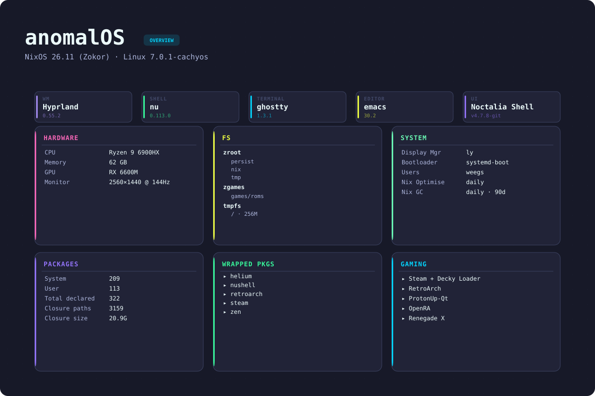
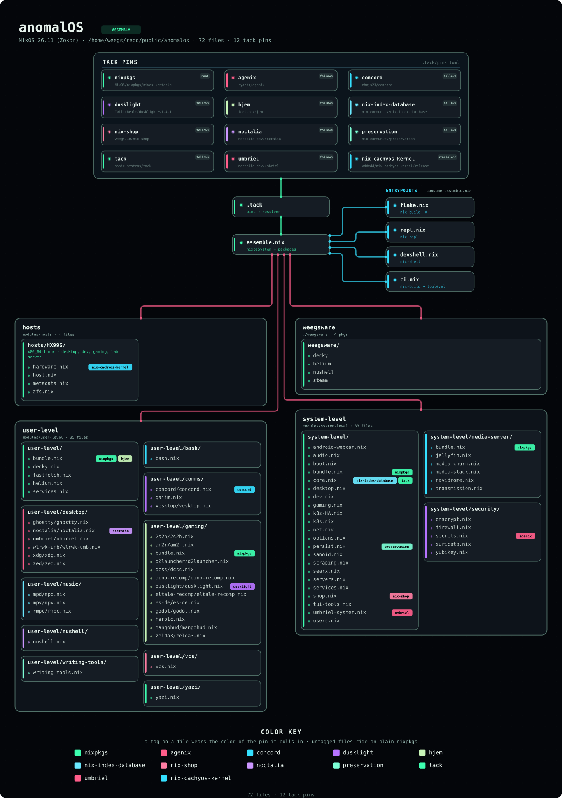

# anomalOS - my gaming centric NixOS configuration

> **Important**: this is a hobbyist project. im learning as i go. if somethings broken or stupid, thats why. this config is designed for my machine and my workflow. it might work on your system, it might not. there are no guarantees. youre welcome to use the whole thing or just steal bits and pieces. its all FOSS, so do whatever you want with it.

> **Requirements**: nushell is required for this configuration. shell wrapper scripts and utilities are written in nushell and will not work without it. nushell is included in the config, but if youre cherry-picking modules, make sure you have it installed. you have been warned.





## features

<details>
<summary>desktop</summary>

Hyprland with noctalia-shell for the bar, launcher, lock screen, and control center. config module at `modules/hjem/hyprland.nix`, which generates a Lua config at `~/.config/hypr/hyprland.lua` at runtime.

**workspaces:**

1. **comms** -- concord (Discord TUI), gajim+biboumi (XMPP+IRC)
2. **dev** -- ghostty, emacs
3. **web** -- Zen Browser
4. **games** -- steam, heroic
5. **media** -- Jellyfin (Zen kiosk), mpv, gimp, inkscape, rmpc

- **stash** (special) -- pavucontrol, nmtui, blueman, LACT, btop, piper, pulsemixer, cliphist

**keybinds:**

| #   | key                | action                            |
| --- | ------------------ | --------------------------------- |
| 0   | Super+1-5          | switch workspace                  |
| 1   | Super+Shift+1-5    | move window to workspace          |
| 2   | Super+PageUp/Down  | cycle workspaces                  |
| 3   | Super+MouseWheel   | cycle workspaces                  |
| 4   | Super+grave        | toggle stash                      |
| 5   | Super+Shift+grave  | move window to stash              |
| 6   | Super+Return       | ghostty                           |
| 7   | Super+Space        | yazi                              |
| 8   | Super+Escape       | close window                      |
| 9   | Super+F            | fullscreen                        |
| 10  | Super+G            | float toggle                      |
| 11  | Super+Backspace    | resize mode (arrows, esc to exit) |
| 12  | Super+Arrows       | move focus                        |
| 13  | Super+Shift+Arrows | move window                       |
| 14  | Super+Home/End     | volume up/down                    |
| 15  | Super+Pause        | mute                              |
| 16  | Super (tap)        | wlr-which-key menu                |
| 17  | Super+Tab          | noctalia control center           |
| 18  | Ctrl+Alt+L         | lock screen                       |
| 19  | Ctrl+Alt+Delete    | power menu                        |
| 20  | Print              | capture menu                      |

wlr-which-key is the primary navigation layer. Super tap opens it for app launches, system tools, screenshots, power menu. full menu in `modules/hjem/wlr-which-key.nix`.

</details>

<details>
<summary>security</summary>

- **YubiKey** -- U2F for login, sudo, polkit. touch required on every auth.
- **firewall** -- nftables. drops everything by default. SSH on port 2222. gaming ports 23243-23262 (Divinity Original Sin 2). Jellyfin on 8096. Decky Loader web UI on 8080. Tailscale interface trusted. ping blocked.
- **Suricata** -- inline IPS running in NFQ mode, logs to `/var/log/suricata/`. can drop packets, not just detect.
- **DNSCrypt** -- encrypted DNS via dnscrypt-proxy, Cloudflare + Quad9, DNSSEC required, no-logging servers required, IPv6 queries blocked. systemd-resolved and unbound are disabled.
- **kernel hardening** -- ASLR, kernel pointer hiding, dmesg restricted to root, ptrace limited to parent processes, core dumps disabled, SYN flood protection, TCP TIME_WAIT protection, ICMP redirect rejection, reverse path filtering.

</details>

<details>
<summary>development</summary>

- **emacs** -- primary editor with LSP for nix, python, rust, hyprlang, nushell. full config in `modules/hjem/emacs/emacs.nix`.
- **devshell** -- `nix develop` drops into nushell with: nixd, nil, nixfmt, basedpyright, ruff, hyprls, nufmt, marksman, biome, clippy, rust-analyzer, rustfmt, dprint, typescript, typescript-language-server, nushell. see [Contributing](#contributing).
- **Claude Code** -- AI-assisted dev, `cc` alias launches `claude-launcher` with project selection.
- **nix-search-tv** -- `ns` for fzf-powered package search.
- **nix-index + nix-index-database** -- command-not-found handler with pre-built community DB, comma integration.

</details>

<details>
<summary>gaming</summary>

- **steam** -- Proton, Gamescope, controller support, 32-bit compat.
- **heroic** -- Epic/GOG launcher, globally wired with Gamescope (2560x1440, 144fps, wayland backend).
- **Decky Loader** -- steam plugin system, web UI at localhost:8080.
- **MangoHud** -- performance overlay, 5 presets (0=off to 4=full), Shift+F12 to toggle.
- **gamemode** -- globally enabled.
- **emulators** -- RetroArch (33 cores), PPSSPP (RetroArch core), melonDS (DS, RetroArch core), ProtonUp-Qt, OpenRA.
- **DCSS** -- Dungeon Crawl Stone Soup, wired in `modules/hjem/dcss.nix`.

</details>

<details>
<summary>media</summary>

- **audio** -- Pipewire + WirePlumber, hardware mixing, Bluetooth (A2DP, aptX, LDAC, AAC, SBC-XQ). HFP/HSP disabled.
- **music** -- MPD + rmpc TUI client. Navidrome streaming server accessible over Tailscale. `snag` for playlist to MP3, `yoink` for video downloads, `sync-music` for ADB sync to Android.
- **media server** -- Jellyfin with VAAPI hardware decode. arr suite: Radarr, Sonarr, Prowlarr, Bazarr, FlareSolverr, Recyclarr. Transmission as system service, tremc TUI.
- **media creation** -- GIMP 3, Inkscape, gpu-screen-recorder (replay buffer).
- **video playback** -- mpv, Jellyfin via Zen kiosk mode.

</details>

## ZFS setup

| #   | dataset             | mount                               |
| --- | ------------------- | ----------------------------------- |
| 0   | zroot/root          | / (tmpfs -- 256MB, wiped on reboot) |
| 1   | zroot/nix           | /nix                                |
| 2   | tmpfs               | /tmp (5GB)                          |
| 3   | zroot/persist       | /persist                            |
| 4   | zroot/cache         | /cache                              |
| 5   | zgames/games/roms   | /mnt/games/1g1r                     |
| 6   | zgames/games/steam  | /mnt/games/SteamLibrary             |
| 7   | zgames/games/heroic | /mnt/games/heroic                   |

automated snapshots via sanoid. `zroot/persist` uses the `desktop` template (hourly=12, daily=7, weekly=2, monthly=1). `zgames/games/roms` has a lighter custom policy (hourly=6, daily=3, weekly=1). compression and auto-trim enabled.

i use ZFS because i like the snapshot safety net. i inevitably break or delete things (im dumb), and having ZFS + jujutsu + NixOS generations means i can almost always undo it.

worth knowing: `/` is a tiny 256MB tmpfs and gets wiped on every boot -- its intentionally small so youll hit an out-of-space error immediately if you forget to persist something, rather than silently losing it on next reboot. `/tmp` is a separate 5GB tmpfs. `/persist` is where your actual stuff lives. more on this below.

<details>
<summary>ZFS snapshots & recovery</summary>

Automated snapshots via [sanoid](https://github.com/jimsalterjrs/sanoid). Snapshots are copy-on-write -- they start at nearly zero space and only grow as data changes.

Templates are defined in `modules/nixos-modules/sanoid.nix`. Dataset assignments are in `modules/hosts/hx99g-zfs.nix`.

**list snapshots:**

```bash
zfs list -t snapshot                          # all snapshots
zfs list -t snapshot -r zroot/persist         # specific dataset
zfs list -t snapshot -o name,used,refer       # with space usage
```

**restore a file:**

every dataset has a `.zfs/snapshot` directory:

```bash
ls /persist/.zfs/snapshot/
cp /persist/.zfs/snapshot/autosnap_2025-12-11_16:00:00_hourly/path/to/file ~/restored-file
```

**restore a directory:**

```bash
cp -a /persist/.zfs/snapshot/autosnap_2025-12-11_12:00:00_hourly/path/to/dir /tmp/restored-dir
# verify it looks right, then move it where you want
```

**rollback entire dataset:**

this destroys everything after the snapshot. be sure.

```bash
sudo zfs rollback zroot/persist@autosnap_2025-12-11_12:00:00_hourly
```

**manual snapshot:**

```bash
sudo zfs snapshot zroot/persist@manual-$(date +%Y%m%d-%H%M%S)
# or kick sanoid:
sudo systemctl start sanoid.service
```

**check snapshot space:**

```bash
zfs list -o name,used,avail,refer,usedsnap,usedds
# usedsnap = how much your snapshots are actually using
```

**sanoid health:**

```bash
systemctl status sanoid.service
systemctl status sanoid.timer
sudo journalctl -u sanoid.service -f
```

snapshots are local to the drive. they protect against accidental deletion and corruption, not hardware failure. your config is in git (GitHub/Codeberg) -- thats your system backup. critical personal data needs an external backup too.

**troubleshooting:**

```bash
# snapshots not being created
systemctl status sanoid.timer
sudo journalctl -u sanoid.service -n 50
sudo systemctl start sanoid.service

# out of space
zfs list -o space
# reduce retention in modules/nixos-modules/sanoid.nix and rebuild

# cant delete a snapshot (probably has dependent clones)
zfs list -t all | grep <snapshot-name>
# destroy the clones first
```

</details>

## getting started

> **Important**: this config is for my machine. might work on yours, might not. no guarantees.

**fork before you build.** `assemble.nix` injects one local path pointing at an absolute location on my machine:

```nix
fft-ivalice-cursor = /home/weegs/.local/share/cursor-sources/fft-ivalice-hyprcursor;
```

this is consumed by `modules/hjem/desktop/xdg/xdg.nix`. nix will blow up evaluating the system if that path doesnt exist on your machine. fork the repo, remove the `fft-ivalice-cursor` injection from `assemble.nix`, and remove `inputs.fft-ivalice-cursor` from `xdg.nix`. or swap it for a cursor theme you have.

**hardware:** x86_64 with AVX2, BMI2, and XSAVE (x86_64-v3 -- most CPUs from 2013+ are fine, not all). AMD-only hardware config. Intel users need to change `boot.zfs.devNodes` from `"/dev/disk/by-partuuid"` to `"/dev/disk/by-id"` in `modules/hosts/hx99g-hardware.nix` and drop the AMD microcode stuff. internet, at least 100GB free.

**persistence.** the root filesystem (`/`) is a 256MB tmpfs -- it gets wiped on every reboot. `/persist` holds the stuff that actually matters (home dirs, SSH keys, network connections). `/cache` is for things youd rather not redownload but wont lose sleep over if theyre gone. everything else gets rebuilt from the nix store on boot. uses [nix-community/preservation](https://github.com/nix-community/preservation) (pure systemd tmpfiles + mounts, no bash). if something goes missing after a reboot, check `modules/nixos-modules/persist.nix` to see whats persisted.

**before you run install.sh**, set these in your host config:

- `networking.hostId` -- `head -c 8 /etc/machine-id`
- `mySystem.user.name`, `mySystem.hostName`
- `initialPassword` for root and your user (see comments in install.sh)

boot a NixOS live ISO, then:

```bash
git clone https://codeberg.org/YOUR_FORK/AnomalOS.git ~/dotfiles
cd ~/dotfiles

# read the comments in install.sh before you run this
./install.sh
```

install.sh handles partitioning (1GB EFI boot, 16GB swap used during install only, rest ZFS), pool creation, and nixos-install. after first boot zram takes over swap -- the partition is just there for the installer. full details in the script. see `modules/hosts/hx99g-hardware.nix` for the dataset layout.

**encryption:** install.sh will ask. also set `boot.zfs.requestEncryptionCredentials = true` in your host config.

**post-install YubiKey setup** (the module is always loaded -- no YubiKey? rename `modules/nixos-modules/yubikey.nix` to `_yubikey.nix`):

```bash
# persist this directory BEFORE creating the key file -- it lives under /home which
# is backed by tmpfs. add ~/.config/Yubico to your preservation user directories first.

mkdir -p ~/.config/Yubico
pamu2fcfg > ~/.config/Yubico/u2f_keys

# test it -- should require a touch
sudo echo "YubiKey working!"
```

**verify:**

- [ ] desktop loads
- [ ] network works
- [ ] audio works (`systemctl --user status pipewire`)
- [ ] YubiKey requires touch (if enabled)

**after install, stop using raw nixos-rebuild:**

```bash
nrt    # test changes (safe -- reverts on reboot)
nrs    # apply changes
```

note: `nrs` also pushes the system closure to my cachix cache after switching. you dont have write access to it, so that part will fail -- the rebuild itself is fine.

**recovery:** boot wont come up? select a previous generation from the boot menu -- NixOS keeps them for this exact reason.

<details>
<summary>USB recovery steps</summary>

```bash
sudo zpool import -f zroot
sudo mount -t zfs zroot/root /mnt
sudo mount /dev/disk/by-label/NIXBOOT /mnt/boot
sudo mount -t zfs zroot/nix /mnt/nix
sudo mount -t zfs zroot/persist /mnt/persist
sudo mount -t zfs zroot/cache /mnt/cache

sudo nixos-enter --root /mnt

nh os switch --file /home/YOUR_USERNAME/dotfiles/assemble.nix YOUR_HOSTNAME
exit

sudo reboot
```

</details>

## how it works

everything is managed with [tack](https://github.com/manic-systems/tack) and hjem -- no flakes. inputs are pinned in `.tack/pins.toml`, and `assemble.nix` builds the system via `nixpkgs.lib.nixosSystem`. shareables (`modules/shareables/`) are wrapped packages with configs baked in, threaded to consumers via the `packages` specialArg.

adding new modules is ezpz. everything in `modules/hjem/`, `modules/nixos-modules/`, and `modules/shareables/` gets auto-discovered -- drop a file and its in. files prefixed with `_` are skipped. shareables autodiscover too now (each returns `{ name = drv; }`), so theyre no longer a special case.

nix reads the working copy directly (plain `import`, not flake eval), so new files are visible immediately -- no `jj s` needed before a build, unlike flakes. you still snapshot for version control, just not to make nix see your edits.

**system modules** (`modules/nixos-modules/`) -- NixOS-level stuff. services, packages, kernel, networking:

```nix
{ config, lib, pkgs, ... }: {
  # your config here
}
```

**user config modules** (`modules/hjem/`) -- anything that goes in `~/.config` or `~/.local/share`:

```nix
{ config, lib, pkgs, ... }:
let username = config.mySystem.user.name; in
{
  config = {
    hjem.users.${username} = {
      # ...
    };
  };
}
```

theres no feature toggle system. all modules load unconditionally. to disable something, rename the file with a `_` prefix or just delete it. `options.nix` only covers host identity (`mySystem.user`, `mySystem.hostName`, `mySystem.timeZone`) -- nothing fancier than that.

**adding packages:** user packages go in `modules/hjem/hjem-packages.nix`. system-wide stuff goes in the relevant module.

<details>
<summary>secrets (agenix)</summary>

Secret management via [agenix](https://github.com/ryantm/agenix). Secrets are encrypted with your SSH keys, committed to git encrypted, and decrypted to `/run/agenix/` (tmpfs) at boot -- gone on reboot.

**how it works:**

- encrypted `.age` files live in `secrets/` and are safe to commit
- `secrets/secrets.nix` maps each `.age` filename to its recipient public keys (what agenix reads)
- `modules/nixos-modules/secrets.nix` wires secrets into the system config via `age.secrets.*`
- identity path is `/persist/etc/ssh/ssh_host_ed25519_key` -- if that key is missing, agenix silently fails at boot
- decrypts to `/run/agenix/` at boot

**currently configured secrets:** tailscale-authkey, discord-token, radarr-api-key, sonarr-api-key, jellyfin-api-key.

**create a secret:**

```bash
cd ~/repo/public/anomalos

# create/edit the secret (opens $EDITOR)
nix run github:ryantm/agenix -- -e secrets/my-secret.age

# snapshot so nix can see it
jj s
```

**declare it in the relevant module:**

```nix
age.secrets.my-secret = {
  file = ./secrets/my-secret.age;
  owner = "weegs";
  mode = "400";
};

# reference the decrypted path:
programs.something.passwordFile = config.age.secrets.my-secret.path;
# resolves to: /run/agenix/my-secret
```

**add to `secrets/secrets.nix`** (the agenix recipient file):

```nix
let
  weegs = "ssh-ed25519 AAAA... weegs@HX99G";
  HX99G = "ssh-ed25519 AAAA... root@nixos";
  allKeys = [weegs HX99G];
in {
  "secrets/my-secret.age".publicKeys = allKeys;
}
```

**edit existing secret:**

```bash
nix run github:ryantm/agenix -- -e secrets/my-secret.age
```

**rekey (after changing SSH keys):**

```bash
nix run github:ryantm/agenix -- -r
```

**adding a new machine:**

```bash
# 1. get the new machine's host key
sudo cat /etc/ssh/ssh_host_ed25519_key.pub

# 2. add it to secrets/secrets.nix
# 3. rekey all secrets
nix run github:ryantm/agenix -- -r
jj s
```

**troubleshooting:**

```bash
ssh-add -L                                                  # check loaded keys
nix run github:ryantm/agenix -- -d secrets/my-secret.age   # try manual decrypt
ls -la /run/agenix/                                         # check permissions
grep -r "age.secrets" ~/repo/public/anomalos/modules/      # check declaration exists
```

YubiKey-backed SSH keys work fine at boot, but creating or editing secrets interactively can be flaky. if agenix hangs, use a regular SSH key instead.

</details>

## jujutsu workflow

anomalos uses [jujutsu](https://jj-vcs.github.io/jj/latest/) in colocated mode (`.git/` is exposed so the GitHub/Codeberg remotes work). all jj operations automatically sync to git.

<details>
<summary>jj reference</summary>

**mental model:**

- your working copy (@) IS a commit, not "dirty" state
- changes are automatically tracked and amend @ commit
- no staging area -- `jj n` finalizes current work and creates a new empty commit
- bookmarks dont auto-move -- you move them explicitly

**daily workflow:**

```bash
# make changes
emacsclient -nw modules/hjem/something.nix

# check what changed
jj s
jj d

# describe and finalize
jj dm "add wireguard configuration"
jj n          # creates new empty commit (finalizes current)

# test
nrt

# if broken, fix and squash
jj sq

# push to both remotes (GitHub + Codeberg)
jj-push       # nushell def: fetch + push + fetch
```

**note:** under pure tack, nix reads the working copy directly -- no `jj s` needed before `nix eval` or `repl` (that was a flakes-only requirement). snapshot when you want a version-control checkpoint, not to make nix see your edits.

**core commands:**

```bash
# viewing
jj s          # status
jj l          # recent commits
jj ll         # detailed log
jj d          # diff working copy
jj dp         # diff against parent (@-)
jj ds         # diff stats

# change management
jj dm "msg"   # describe current commit
jj n          # create new empty commit (finalizes current)

# manipulation
jj sq         # squash into parent
jj sp         # split commit interactively
jj spi        # split with interface

# bookmarks
jj bs <name> -r <rev>   # set bookmark to revision
jj tug                   # move closest bookmark to @-

# remotes
jj f          # fetch from default remote
jj p          # push
jj-fetch      # nushell alias: jj git fetch --all-remotes
jj-push       # nushell def: fetch + push + fetch (safe push workflow)
jj-pull       # nushell def: fetch + move main bookmark to main@origin
jj-commit     # nushell def: interactive split + bookmark move

# recovery
jj u          # undo last operation
```

everything is recoverable via operation log. `jj u` works for rebases, squashes, deletions, etc.

**key aliases** (configured in `modules/hjem/jujutsu.nix`):

| alias        | expands to                                                  |
| ------------ | ----------------------------------------------------------- |
| `s`          | status                                                      |
| `d`          | diff                                                        |
| `dp`         | diff against parent (@-)                                    |
| `ds`         | diff stats                                                  |
| `dm "msg"`   | describe                                                    |
| `n`          | new commit                                                  |
| `sq`         | squash                                                      |
| `sp` / `spi` | split                                                       |
| `p`          | push                                                        |
| `f`          | fetch (default remote only -- use jj-fetch for all remotes) |
| `u`          | undo                                                        |
| `l` / `ll`   | log (short / detailed)                                      |
| `bs`         | bookmark set                                                |
| `tug`        | move closest bookmark to @-                                 |

**nushell defs** (defined in `modules/hjem/nushell.nix`):

| def         | what it does                              |
| ----------- | ----------------------------------------- |
| `jj-fetch`  | `jj git fetch --all-remotes`              |
| `jj-push`   | fetch + push + fetch (safe push workflow) |
| `jj-pull`   | fetch + move main bookmark to main@origin |
| `jj-commit` | interactive split + bookmark move         |

**git vs jj:**

| git             | jj                        | notes                  |
| --------------- | ------------------------- | ---------------------- |
| `git status`    | `jj s`                    |                        |
| `git diff`      | `jj d`                    |                        |
| `git commit -m` | `jj dm "msg"` then `jj n` | describe then finalize |
| `git push`      | `jj p`                    |                        |
| `git fetch`     | `jj f`                    | no auto-merge          |
| `git undo`      | `jj u`                    | undo last operation    |
| `git branch`    | `jj bs`                   | set bookmark           |

**git remotes:** colocate mode exposes `.git/` so the GitHub/Codeberg remotes work. files are automatically exported to git on every jj command.

</details>

## maintenance

```bash
tu                     # tack update -- refresh all pins
tu nixpkgs             # update a single pin
tl                     # tack look -- pins with newer upstream
nrt                    # test changes (safe -- reverts on reboot)
nrs                    # apply changes + push closure to cachix
nrbt                   # boot -- applies changes on next boot only
nrbld                  # build without switching
recycle                # keep last 10 generations, GC the rest
```

**config broke everything:**

```bash
cd ~/repo/public/anomalos
jj log        # find the last working commit
jj edit <id>
nrs
```

**rollback:**

```bash
sudo nixos-rebuild switch --rollback
```

**YubiKey locked you out:** boot single-user mode, rename `modules/nixos-modules/yubikey.nix` to `_yubikey.nix`, rebuild.

<details>
<summary>troubleshooting</summary>

**build failures:**

```bash
sudo nix-collect-garbage -d && nrt

tu nixpkgs                 # refresh a pin / hash mismatch
rm -rf ~/.cache/nix         # clear eval cache
nh os test -- --show-trace  # verbose output (nrt doesnt pass args through)
```

**Hyprland wont start:**

```bash
cat /tmp/hypr/$(ls -t /tmp/hypr/ | head -1)/hyprland.log
echo $XDG_SESSION_TYPE  # should be "wayland"
```

**noctalia missing:**

```bash
noct-r
journalctl --user -u noctalia-shell
```

**audio:**

```bash
systemctl --user restart pipewire pipewire-pulse wireplumber
```

**general:**

```bash
journalctl -xe
systemctl --failed
systemctl --user --failed
```

help: [NixOS Discourse](https://discourse.nixos.org/) -- [NixOS Wiki](https://nixos.wiki/) -- [Issues](https://codeberg.org/weegs710/AnomalOS/issues)

</details>

## contributing

feel free to fork this and do whatever. if you find bugs or have improvements, pull requests are welcome -- just run `nix develop` first so were using the same tools and formatter. the devshell has everything: nixd, nil, nixfmt, basedpyright, ruff, hyprls, nufmt, marksman, biome, clippy, rust-analyzer, rustfmt, dprint, typescript, and nushell.

but remember, this is primarily my personal config, and i am still fairly new to this stuff.

## credits

| #   | who                                         | for                                                 |
| --- | ------------------------------------------- | --------------------------------------------------- |
| 0   | [iynaix](https://github.com/iynaix)         | code examples, good practices, and logical thinking |
| 1   | [jet](https://github.com/Michael-C-Buckley) | NixOS nuances and code snippets                     |
| 2   | [ladas](https://github.com/Ladas552)        | nagging me about stuff i can improve                |
| 3   | [vimjoyer](https://github.com/vimjoyer)     | videos and his amazing discord server               |

## license

MIT license. do whatever you want with it.

## links

- Codeberg: https://codeberg.org/weegs710/AnomalOS
- Website: https://weegs.dev
