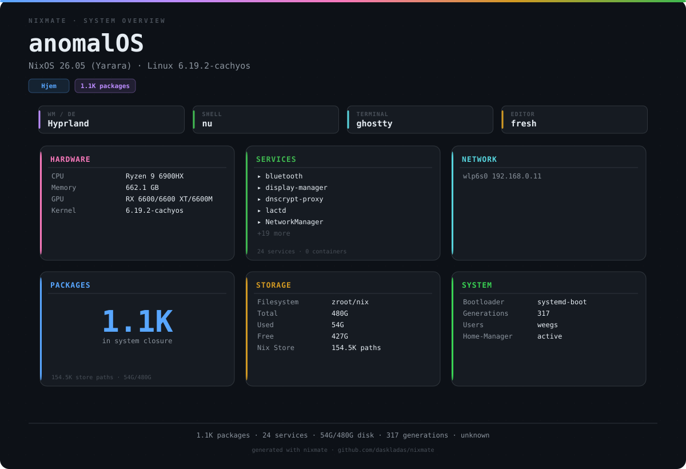

# anomalOS - my gaming centric NixOS configuration

> **Important**: This is a hobbyist project. I'm learning as I go. If something's broken or stupid, that's why. This config is designed for my machine and my workflow. It might work on your system, it might not. There are no guarantees. You're welcome to use the whole thing or just steal bits and pieces. It's all FOSS, so do whatever you want with it.

> **Requirements**: Nushell is required for this configuration. Shell wrapper scripts and utilities are written in nushell and will not work without it. Nushell is included in the flake, but if you're cherry-picking modules, make sure you have it installed. You have been warned.



## What's in here

- **Kernel:** CachyOS Linux 6.19.2 with v3 microcode, bbr3 network control, and zfs support patches.
- **WM**: hyprland (pure wayland) with noctalia-shell
- **Display Manager**: ly
- **Shell**: nushell with oh-my-posh prompt
- **Editors**: zed (GUI) fresh (TUI)
- **Term**: ghostty
- **Filesystem**: zfs with automated snapshots
- **Gaming**: steam with proton tooling, decky-loader, mangohud, and bunch of emulators

## My zfs setup

- `zroot` pool on NVMe for system/nix/home
- `zgames` pool on a separate drive for games (optional)
- Automated hourly/daily/weekly/monthly snapshots via sanoid
- Compression and auto-trim enabled

The files in `docs/` have more detailed instructions if you actually want to use this. Those files are primarally for me to reference for later.

- [Installation Guide](docs/INSTALLATION.md) - Full install instructions
- [Configuration Options](docs/CONFIGURATION.md) - All the knobs you can turn
- [Features](docs/FEATURES.md) - What's actually in here
- [Maintenance](docs/MAINTENANCE.md) - Routine maintenance and updates
- [Secrets](docs/SECRETS.md) - Agenix setup for managing secrets
- [Backups](docs/BACKUP.md) - ZFS snapshot management
- [Troubleshooting](docs/TROUBLESHOOTING.md) - When things break

## Adding stuff

> **Important**: Files prefixed with `_` are excluded from auto-import with file filtering — that's how `_hardware-configuration.nix` stays out of the way.

Everything is managed with flake parts and hjem. I also include fully portable preconfigured pkgs in shareables. I use zfs because I like the compression and snapshot saftey net, I'd rather not lose stuff when I inevitably break or delete something on accident (I'm dumb). This just makes sense to pair with jujutsu and NixOS. I am also using tmpfs for impermanence with a small size as a tripwire to remind me when I forgot to persist something.

- Because of the flake-parts setup, adding new modules is ezpz. Everything in `modules/` gets auto-imported, just drop a file and it's in.

System-level stuff goes in `modules/nixos-modules/`:

```nix
{ inputs, self, ... }:
{
  flake.nixosModules.my-new-thing = { config, lib, pkgs, ... }:
    with lib; {
      config = mkIf config.mySystem.features.whatever {
        # your config here
      };
    };
}
```

User config files (anything that ends up in `~/.config` or `~/.local/share`) go in `modules/hjem/`:

```nix
{...}: {
  flake.nixosModules.my-app = { config, lib, pkgs, ... }: let
    username = config.mySystem.user.name;
  in with lib; {
    config = mkIf config.mySystem.features.whatever {
      hjem.users.${username}.xdg.config.files = {
        "my-app/config".text = ''
          # your config here
        '';
      };
    };
  };
}
```

## Contributing

Feel free to fork this and do whatever. If you find bugs or have improvements, pull requests are welcome -- I would prefer that you utilize the devshell (**currently in transition**) to ensure that you use the same tooling and formatter I do. But remember, this is primarily my personal config, and I am still fairly new to this stuff.

## License

MIT License. Do whatever you want with it.

## Links

- GitHub: https://github.com/weegs710/AnomalOS
- Codeberg: https://codeberg.org/weegs710/AnomalOS
