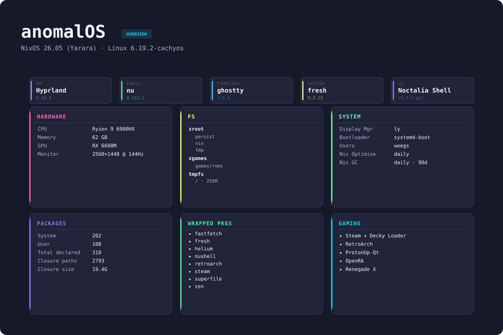
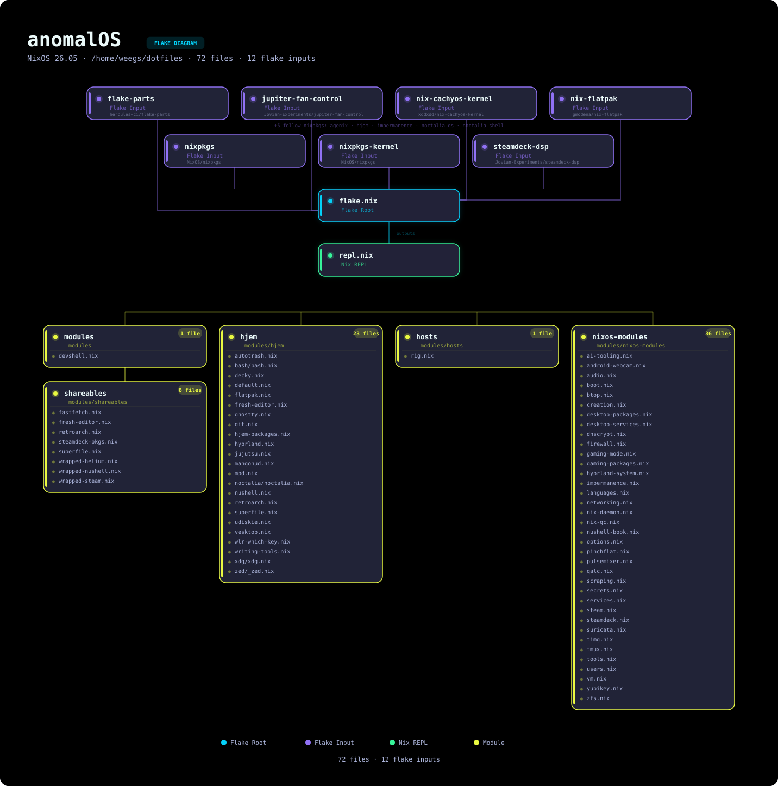

# anomalOS - my gaming centric nixOS configuration

> **Important**: this is a hobbyist project. im learning as i go. if somethings broken or stupid, thats why. this config is designed for my machine and my workflow. it might work on your system, it might not. there are no guarantees. youre welcome to use the whole thing or just steal bits and pieces. its all FOSS, so do whatever you want with it.

> **Requirements**: nushell is required for this configuration. shell wrapper scripts and utilities are written in nushell and will not work without it. nushell is included in the flake, but if youre cherry-picking modules, make sure you have it installed. you have been warned.





## features

<details>
<summary>desktop</summary>

Hyprland with noctalia-shell for the bar, launcher, lock screen, and control center. single config at `modules/hjem/hyprland.nix`.

**workspaces:**
1. **comms** -- vesktop, gajim
2. **dev** -- fresh, ghostty
3. **games** -- steam
4. **media** -- Euphonica, Stremio
5. **web** -- Helium
- **stash** (special) -- pavucontrol, nmtui, blueman, LACT, btop, piper, pulsemixer, cliphist

**keybinds:**

| # | key | action |
|---|-----|--------|
| 0 | Super+1-5 | switch workspace |
| 1 | Super+Shift+1-5 | move window to workspace |
| 2 | Super+PageUp/Down | cycle workspaces |
| 3 | Super+MouseWheel | cycle workspaces |
| 4 | Super+grave | toggle stash |
| 5 | Super+Shift+grave | move window to stash |
| 6 | Super+Return | ghostty |
| 7 | Super+Space | superfile |
| 8 | Super+Escape | close window |
| 9 | Super+F | fullscreen |
| 10 | Super+G | float toggle |
| 11 | Super+Backspace | resize mode (arrows, esc to exit) |
| 12 | Super+Arrows | move focus |
| 13 | Super+Shift+Arrows | move window |
| 14 | Super+Home/End | volume up/down |
| 15 | Super+Pause | mute |
| 16 | Super (tap) | wlr-which-key menu |
| 17 | Super+Tab | noctalia control center |
| 18 | Ctrl+Alt+L | lock screen |
| 19 | Ctrl+Alt+Delete | power menu |
| 20 | Print | capture menu |

wlr-which-key is the primary navigation layer. Super tap opens it for app launches, screenshots, power menu. full menu in `modules/hjem/wlr-which-key.nix`.

</details>

<details>
<summary>security</summary>

- **YubiKey** -- U2F for login, sudo, polkit. auto-login on plug, auto-lock on unplug.
- **firewall** -- nftables. drops everything by default. SSH on port 2222. gaming ports 23243-23262 open for Divinity Original Sin 2. Decky Loader web UI on 8080.
- **Suricata** -- network intrusion detection, logs to `/var/log/suricata/`
- **DNSCrypt** -- encrypted DNS via dnscrypt-proxy, Cloudflare + Quad9, DNSSEC required
- **kernel hardening** -- ASLR, stack protection, kernel pointer hiding, SYN flood protection, ICMP rate limiting

</details>

<details>
<summary>development</summary>

- **fresh** -- TUI editor with LSP for nix, python, rust, hyprlang, nushell. full toolchain (nixd, nixfmt, basedpyright, ruff, hyprls, nufmt, marksman) baked into the wrapper.
- **devshell** -- `nix develop` drops into nushell with the same tools. see [Contributing](#contributing).
- **Claude Code** -- AI-assisted dev, `cc` alias for project management
- **nix-search-tv** -- `ns` for fzf-powered package search
- **nix-index** -- command-not-found handler

</details>

<details>
<summary>gaming</summary>

- **steam** -- Proton, Protontricks, Gamescope, controller support, 32-bit compat
- **Decky Loader** -- steam plugin system, web UI at localhost:8080
- **MangoHud** -- performance overlay, 5 presets (0=off → 4=full), Shift+F12 to toggle
- **emulators** -- RetroArch (16 cores), PPSSPP, DeSmuME, Ryujinx, ProtonUp-Qt

</details>

<details>
<summary>media</summary>

- **audio** -- Pipewire + WirePlumber, hardware mixing, Bluetooth (A2DP, HSP/HFP)
- **music** -- MPD + Euphonica GTK4 client. Beets for tagging with MusicBrainz. `scrapem` for playlists → MP3, `scrapev` for video.
- **media creation** -- GIMP 3, OBS Studio, Video2x
- **streaming** -- Stremio for video, Transmission for torrents

</details>

## ZFS setup

| # | dataset | mount |
|---|---------|-------|
| 0 | zroot/root | / (tmpfs -- 256MB, wiped on reboot) |
| 1 | zroot/nix | /nix |
| 2 | zroot/tmp | /tmp |
| 3 | zroot/persist | /persist |
| 4 | zroot/cache | /cache |
| 5 | zgames/* | /mnt/games/* (optional) |

automated hourly/daily/weekly/monthly snapshots on `zroot/persist` via sanoid. compression and auto-trim enabled.

i use ZFS because i like the snapshot safety net. i inevitably break or delete things (im dumb), and having ZFS + jujutsu + nixOS generations means i can almost always undo it. see [ZFS Snapshots & Recovery](docs/BACKUP.md).

worth knowing: `/` is a tiny 256MB tmpfs and gets wiped on every boot -- its intentionally small so youll hit an out-of-space error immediately if you forget to persist something, rather than silently losing it on next reboot. `/persist` is where your actual stuff lives. more on this below.

## getting started

> **Important**: this config is for my machine. might work on yours, might not. no guarantees.

**fork before you build.** there are two flake inputs pointing to absolute paths on my machine:

```nix
fft-ivalice-cursor = { url = "path:/home/weegs/.local/share/cursor-sources/fft-ivalice-hyprcursor"; ... };
severed-chains = { url = "path:/home/weegs/Documents/test-zone/dragoon/Severed-Chains"; ... };
```

both are consumed by live modules (`modules/hjem/xdg/xdg.nix` and `modules/nixos-modules/gaming-packages.nix`). nix will blow up evaluating the flake if those paths dont exist on your machine. fork the repo and remove both inputs from `flake.nix`, then remove `inputs.fft-ivalice-cursor` from `xdg.nix` and `inputs.severed-chains.packages...` from `gaming-packages.nix`. or swap them for something you have. if you skip this the build fails immediately.

**hardware:** x86_64 with AVX2, BMI2, and XSAVE (x86_64-v3 -- most CPUs from 2013+ are fine, not all). AMD-only hardware config. Intel users need to change `zfs.devNodes` to `"/dev/disk/by-id"` in `modules/hosts/hx99g-hardware.nix` and drop the AMD microcode stuff. internet, at least 100GB free.

**impermanence.** the root filesystem (`/`) is a 256MB tmpfs -- it gets wiped on every reboot. `/persist` holds the stuff that actually matters (home dirs, SSH keys, network connections). `/cache` is for things youd rather not redownload but wont lose sleep over if theyre gone. everything else gets rebuilt from the nix store on boot. if something goes missing after a reboot, check `modules/hosts/hx99g-imperm.nix` to see whats persisted.

**before you run install.sh**, set these in your host config:

- `networking.hostId` -- `head -c 8 /etc/machine-id`
- `mySystem.user.name`, `mySystem.hostName`
- `initialPassword` for root and your user (see comments in install.sh)

boot a nixOS live ISO, then:

```bash
git clone https://github.com/YOUR_FORK/AnomalOS.git ~/dotfiles
cd ~/dotfiles

# read the comments in install.sh before you run this
./install.sh
```

install.sh handles partitioning (1GB EFI boot, 16GB swap used during install only, rest ZFS), pool creation, and nixos-install. after first boot zram takes over swap -- the partition is just there for the installer. full details in the script. see `modules/hosts/hx99g-hardware.nix` for the dataset layout.

**encryption:** install.sh will ask. also set `boot.zfs.requestEncryptionCredentials = true` in your host config.

**post-install YubiKey setup** (the module is always loaded -- no YubiKey? rename `modules/nixos-modules/yubikey.nix` to `_yubikey.nix`):

```bash
mkdir -p ~/.config/Yubico
pamu2fcfg > ~/.config/Yubico/u2f_keys

# test it -- should require a touch
sudo echo "YubiKey working!"
```

**verify:**
- [ ] desktop loads
- [ ] network works
- [ ] audio works (`systemctl --user status pipewire`)
- [ ] YubiKey requires touch (if enabled)

**after install, stop using raw nixos-rebuild:**

```bash
nrt    # test changes (safe -- reverts on reboot)
nrs    # apply changes
```

note: `nrs` also pushes the system closure to my cachix cache after switching. you dont have write access to it, so that part will fail -- the rebuild itself is fine.

**recovery:** boot wont come up? select a previous generation from the boot menu -- nixOS keeps them for this exact reason.

<details>
<summary>USB recovery steps</summary>

```bash
sudo zpool import -f zroot
sudo mount -t zfs zroot/root /mnt
sudo mount /dev/disk/by-label/NIXBOOT /mnt/boot
sudo mount -t zfs zroot/nix /mnt/nix
sudo mount -t zfs zroot/persist /mnt/persist
sudo mount -t zfs zroot/cache /mnt/cache

sudo nixos-enter --root /mnt

nixos-rebuild switch --flake /home/YOUR_USERNAME/dotfiles#YOUR_HOSTNAME
exit

sudo reboot
```

</details>

## how it works

everything is managed with flake-parts and hjem. shareables (`modules/shareables/`) are wrapped packages with configs baked in, referenced via `inputs.self.packages`.

adding new modules is ezpz. everything in `modules/` gets auto-imported -- drop a file and its in. files prefixed with `_` are skipped.

**system modules** (`modules/nixos-modules/`) -- nixOS-level stuff. services, packages, kernel, networking:

```nix
{ inputs, self, ... }:
{
  flake.nixosModules.my-new-thing = { config, lib, pkgs, ... }:
    with lib; {
      # your config here
    };
}
```

**user config modules** (`modules/hjem/`) -- anything that goes in `~/.config` or `~/.local/share`:

```nix
{...}: {
  flake.nixosModules.my-app = { config, lib, pkgs, ... }: let
    username = config.mySystem.user.name;
  in with lib; {
    config = {
      hjem.users.${username}.xdg.config.files = {
        "my-app/config".text = ''
          # your config here
        '';
      };
    };
  };
}
```

theres no feature toggle system. all modules load unconditionally. to disable something, rename the file with a `_` prefix or just delete it. `options.nix` only covers host identity (`mySystem.user`, `mySystem.hostName`, `mySystem.timeZone`) -- nothing fancier than that.

**adding packages:** user packages go in `modules/hjem/hjem-packages.nix`. system-wide stuff goes in the relevant module.

new files need to be git-tracked before nix can see them -- flakes only see git-tracked files.

## maintenance

```bash
nfu                                  # update all flake inputs
nfu nixpkgs                          # update a single input (nixpkgs is an example -- use any input name from flake.nix)
recycle                              # keep last 10 generations, GC the rest
sudo nixos-rebuild switch --rollback # rollback
```

garbage collection and store optimization both run automatically.

**config broke everything:**
```bash
cd ~/dotfiles
jj log        # find the last working commit (or git log if youre not on jj)
jj edit <id>
nrs
```

**YubiKey locked you out:** boot single-user mode, rename `modules/nixos-modules/yubikey.nix` to `_yubikey.nix`, rebuild.

<details>
<summary>troubleshooting</summary>

**build failures:**
```bash
sudo nix-collect-garbage -d && nrt

nix flake update nixpkgs   # hash mismatch
rm -rf ~/.cache/nix         # clear eval cache
nh os test -- --show-trace  # verbose output (nrt doesnt pass args through)
```

**Hyprland wont start:**
```bash
cat /tmp/hypr/$(ls -t /tmp/hypr/ | head -1)/hyprland.log
echo $XDG_SESSION_TYPE  # should be "wayland"
```

**noctalia missing:**
```bash
systemctl --user restart noctalia
journalctl --user -u noctalia
```

**audio:**
```bash
systemctl --user restart pipewire pipewire-pulse wireplumber
```

**general:**
```bash
journalctl -xe
systemctl --failed
systemctl --user --failed
```

help: [nixOS Discourse](https://discourse.nixos.org/) · [nixOS Wiki](https://nixos.wiki/) · [Issues](https://github.com/weegs710/AnomalOS/issues)

</details>

## contributing

feel free to fork this and do whatever. if you find bugs or have improvements, pull requests are welcome -- just run `nix develop` first so were using the same tools and formatter. the devshell has everything: nixd, nil, nixfmt, basedpyright, ruff, hyprls, nufmt, marksman, biome, and nushell.

but remember, this is primarily my personal config, and i am still fairly new to this stuff.

## credits

| # | who | for |
|---|-----|-----|
| 0 | [iynaix](https://github.com/iynaix) | code examples, good practices, and logical thinking |
| 1 | [jet](https://github.com/Michael-C-Buckley) | nixOS nuances and code snippets |
| 2 | [ladas](https://github.com/Ladas552) | nagging me about stuff i can improve |
| 3 | [vimjoyer](https://github.com/vimjoyer) | videos and his amazing discord server |

## license

MIT license. do whatever you want with it.

## links

- GitHub: https://github.com/weegs710/AnomalOS
- Codeberg: https://codeberg.org/weegs710/AnomalOS
- Website: https://weegs.dev
