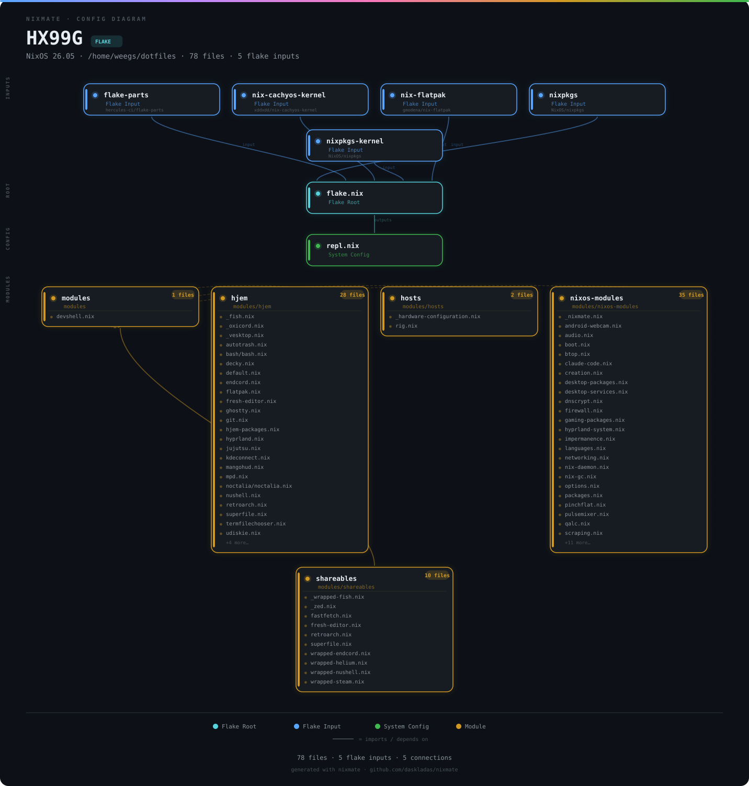

# Configuration

How everything's wired up and how to change it.



## How modules work

Everything in `modules/` gets auto-imported by flake-parts. No manual import lists. Drop a file, it's in.

Two flavors:

**System modules** (`modules/nixos-modules/`) — NixOS-level stuff. Services, packages, kernel, networking:

```nix
{ inputs, self, ... }:
{
  flake.nixosModules.my-thing = { config, lib, pkgs, ... }:
    with lib; {
      config = mkIf config.mySystem.features.whatever {
        # NixOS config here
      };
    };
}
```

**User config modules** (`modules/hjem/`) — anything that goes in `~/.config` or `~/.local/share`, deployed via Hjem:

```nix
{...}: {
  flake.nixosModules.my-app = { config, lib, pkgs, ... }: let
    username = config.mySystem.user.name;
  in with lib; {
    config = mkIf config.mySystem.features.whatever {
      hjem.users.${username}.xdg.config.files = {
        "my-app/config".text = ''
          config stuff here
        '';
      };
    };
  };
}
```

Files starting with `_` get skipped by auto-import. That's how `_hardware-configuration.nix` lives in `modules/hosts/` without getting pulled into flake-parts — it's a plain NixOS module imported directly by rig.nix, not a flake-parts wrapper.

**Shareables** (`modules/shareables/`) are wrapped app packages — binaries built with custom configs baked in, referenced via `inputs.self.packages`.

## Feature toggles

Everything's in `modules/hosts/rig.nix`:

```nix
mySystem = {
  hostName = "HX99G";
  user = {
    name = "weegs";
    extraGroups = [ "networkmanager" "wheel" ];
  };

  features = {
    desktop = true;        # Hyprland + Noctalia
    security = true;       # Firewall, Suricata, kernel hardening
    yubikey = true;        # YubiKey U2F
    claudeCode = true;     # Claude Code
    development = true;    # Dev tools
    gaming = true;         # Steam, emulators
    flatpak = true;        # Declarative Flatpak
    media = true;          # Audio, video, creation
    kdeconnect = true;     # KDE Connect
    vm = true;             # libvirtd
    androidWebcam = true;  # scrcpy webcam
  };

  security = {
    dnscrypt = true;       # Encrypted DNS
  };

  hardware = {
    amd = true;            # AMD GPU
    bluetooth = true;
    steam = true;
  };
};
```

Each flag gates one or more modules. Set `gaming = false` and all the gaming modules become no-ops. Toggle features here, don't delete module files.

## Adding modules

**System module**: create a `.nix` in `modules/nixos-modules/`. Done. Auto-imported next rebuild.

**User config**: create a file in `modules/hjem/`. Modules with companion files (configs, assets) go in subdirectories:

```
modules/hjem/
├── fastfetch/
│   ├── fastfetch.nix
│   └── nixos.png
├── noctalia/
│   ├── noctalia.nix
│   └── settings.json
└── xdg/
    ├── xdg.nix
    └── phinger-cursors-dark-hyprcursor/
```

New files need `git add` before nix can see them — flakes only track git-tracked files.

## Adding packages

User packages are in `modules/nixos-modules/packages.nix`:

```nix
users.users.${config.mySystem.user.name}.packages = with pkgs; [
  # add here
];
```

System-wide packages go in the relevant module or directly in rig.nix.

## Shell aliases

From `modules/nixos-modules/nix-daemon.nix`:

```bash
nrt-rig    # Test Rig config (nh os test)
nrs-rig    # Switch to Rig config (nh os switch)
rig-up     # Update + test + prompt to switch
update     # nix flake update
recycle    # Keep last 10 generations, GC the rest
nfa        # nix flake archive
closure    # Show current system closure size
noct-up    # Update noctalia flake inputs only
```

## Testing workflow

```bash
nix flake check    # Catch syntax errors fast
nrt-rig            # Test (safe — reverts on reboot)
nrs-rig            # Apply if test passed
```

Something broke? Rollback:

```bash
sudo nixos-rebuild switch --rollback
# Or just reboot — test configs revert automatically

# Or use jj to go back to last working commit:
cd ~/dotfiles
jj log          # Find the last good commit
jj edit <id>    # Switch to it
nrs-rig
```

## What's next

- [Features](FEATURES.md) — what each feature actually does
- [Maintenance](MAINTENANCE.md) — routine upkeep
- [Troubleshooting](TROUBLESHOOTING.md) — fixing things
